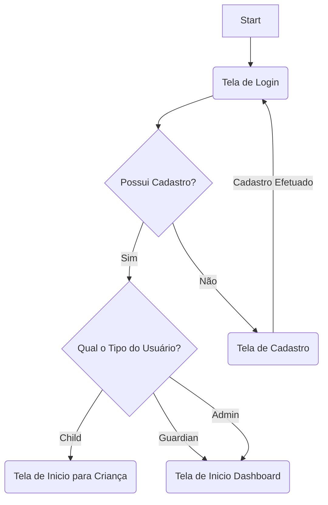

# Documentação Técnica: **Jornada na Educação Financeira Infantil**

Bem-vindo à documentação oficial do projeto **Jornada na Educação Financeira Infantil**. Este documento é o guia principal para entender o intuito do projeto, seus fluxos, e como contribuir para o desenvolvimento.

---

## **1. Sobre o Projeto**

### **1.1 Intuito**
O projeto tem como objetivo **auxiliar na educação financeira das crianças, ajudando-as desde cedo a entender a importância e o valor do dinheiro**.

### **1.2 Visão Geral**
- **Responsável pela documentação**: Caio Maciel
- **Início do Projeto**: --/--/2024
- **Versão Atual**: 1.2

---

## **2. Fluxos do Sistema**

### **2.1 Diagrama de Fluxo**
Aqui você encontra uma visão macro do sistema:



---

## **3. Documentações**

### **3.1 Backend**
Acesse a documentação completa do backend [aqui](a).
Descrição breve:

### **3.2 Frontend**
Acesse a documentação completa do frontend [aqui](a).
Descrição breve:

### **3.3 Banco de Dados**
Acesse o diagrama do banco de dados [aqui](a).
- **Tecnologia Utilizada**: PostgreSQL
- **Descrição**: O banco de dados foi estruturado para...

---

## **4. Como Contribuir**

### **4.1 Criando Commits**
 1. Certifique-se de que o código está funcional antes do commit.
 2. Use a seguinte convenção para commits:
`git commit -m ":sparkles: feat: descrição breve"`
	- **Tipos**: feat, fix, docs, test, build, perf, style, refactor, chore, ci, raw, cleanup, remove
	- Para mais informações acesse [aqui](https://github.com/iuricode/padroes-de-commits).

### **4.2 Criando Pull Requests**
Por convenção estamos utilizando git-flow, acesse a documentação do git-flow [aqui](https://danielkummer.github.io/git-flow-cheatsheet/index.pt_BR.html).
1. Crie uma branch:
`git flow feature start [nome-da-branch]`
	- Nome padrão: descricao-curta
		Exemplo: user-register
2. Faça o commit das alterações
	```bash
	git add .
	git commit -m ":sparkles: feat: descrição breve"
	git push origin -u nome-da-branch
	```
3. Abra um Pull Request:
	- Vá até o repositório no GitHub.
	- Clique em **Pull Requests > New Pull Request**.
	- Preencha o título e a descrição seguindo o **Pull Request Template**.
	- Siga a normalização do git flow, caso a branch seja:
		- Feature: Abra um Pull Request com origem *(compare)* a feature desejado e destino *(base)* a branch *develop*
		- Release: Abra um Pull Request com a origem *(compare)* a release desejado e o destino *(base)* a branch *main* - Lembrando que em caso de pull_request de release deverá criar uma *tag* também
		- HotFix: Abra um Pull Request com a origem *(compare)* a hotfix desejado e o destino *(base)* a branch *main* - Lembrando que em caso de pull_request de hotfix deverá criar uma *tag* também

---

## **5. Padrões de Código**

Siga os padrões de código definidos para o projeto:
- **Lint**: Utilize a ferramenta *ESLint* para manter o código padronizado.
- **Formato**: Respeite o padrão de código com *Prettier*

---

## **6. Links Importantes**
- [Documentação Backend](a)
- [Documentação Frontend](a)
- [Diagrama do Banco de Dados](a)
- [Guia de Contribuição](a)

---

### **7. Contato**
Caso tenha dúvidas ou sugestões, entre em contato:
- GitHub Issues: Utilize a aba de issues para reportar problemas:
	- Backend: Relatar na aba de issues do [Backend](https://github.com/Projeto-Integrador-Univesp-2024/backend/issues).
	- Frontend: Relatar na aba de issues do [Frontend](https://github.com/Projeto-Integrador-Univesp-2024/client/issues).
	- Banco de dados: Relatar na aba de issues do [Docker](https://github.com/Projeto-Integrador-Univesp-2024/docker/issues).
	- Outros: Relatar na aba de issues do [Docs](https://github.com/Projeto-Integrador-Univesp-2024/docs/issues).

---

© 2025 Jornada na Educação Financeira Infantil. Todos os direitos reservados.
